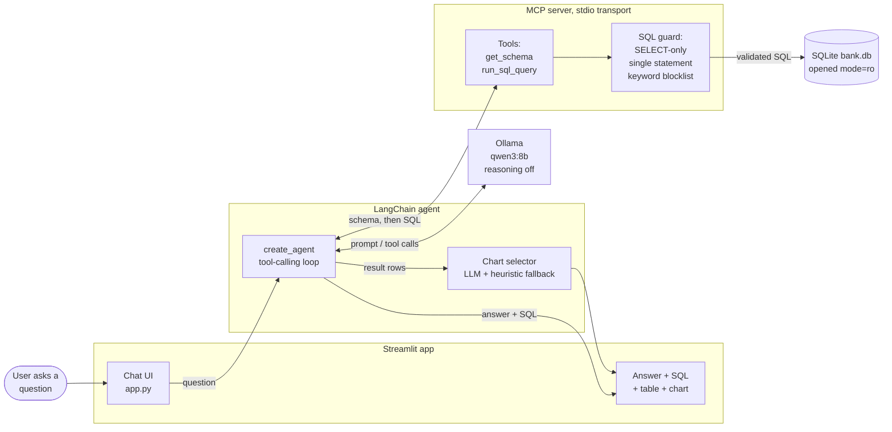

# 🏦 Banker & Branch Analytics — an Agentic Text-to-SQL Assistant

A local-first analytics chatbot. Ask a question about a bank's staff and
branches in plain English; a **LangChain agent** running on a **local Qwen
model** discovers the database schema over **MCP (Model Context Protocol)**,
writes its own SQL, executes it against a read-only database, and returns a
written answer, the generated SQL, a result table, and an auto-selected chart.

No data leaves the machine — inference runs locally through Ollama.

```
Q: "Which region has the most bankers rated Needs Improvement?"

→ agent writes:
    SELECT branches.region, COUNT(*) AS num_bankers
    FROM bankers JOIN branches ON bankers.branch_id = branches.branch_id
    WHERE bankers.performance_rating = 'Needs Improvement'
    GROUP BY branches.region ORDER BY num_bankers DESC LIMIT 1

→ "The region with the most bankers rated Needs Improvement is the
   Northeast, with 15 bankers in that category."
```

---

## System architecture



### How a question flows through the system

| # | Step | Where |
|---|------|-------|
| 1 | User submits a question in the chat box | `app.py` |
| 2 | Agent prefetches the schema from the MCP server | `get_schema` tool |
| 3 | Schema is injected into the system prompt, and the LLM writes SQL | `langchain_agent.py` |
| 4 | SQL is submitted as a tool call and validated before execution | `run_sql_query` tool |
| 5 | Query runs on a **read-only** SQLite connection | `db_tools.run_query` |
| 6 | Rows return; the model writes a plain-English answer | LangChain agent loop |
| 7 | A chart spec is chosen and rendered with Plotly | `charts.build_chart` |

### Design decisions worth calling out

**The agent owns no database code.** Every fact it knows about the bank
arrives through an MCP tool call. Swapping SQLite for Postgres means editing
one MCP server — the agent is untouched.

**SQL and result rows are read from the tool-call trail, not the model's
prose.** The table and chart are always built from the actual query output, so
the model can never mis-transcribe a number into the UI.

**The schema is prefetched programmatically rather than left to the model.**
Early versions let the LLM call `get_schema` as its first turn. It attended to
the schema poorly that way and picked wrong columns (summing `monthly_sales_actual`
when asked for `total_deposits`). Fetching the schema up front and putting it in
the system prompt fixed the accuracy problem *and* removed a model round trip.

**Defense in depth on SQL execution.** The generated SQL must be a single
`SELECT`/`WITH` statement, is checked against a keyword blocklist
(`INSERT/UPDATE/DELETE/DROP/ALTER/CREATE/PRAGMA/ATTACH/…`), and then runs over a
connection opened with SQLite's `mode=ro` URI flag. A trailing semicolon is
stripped rather than rejected — rejecting it caused the model to retry the same
query in an infinite loop.

**Charts degrade gracefully.** The model proposes a chart spec; if it names a
column that doesn't exist, a deterministic heuristic picks a sensible bar chart
instead. A bad chart never costs you the answer.

---

## Tech stack

| Layer | Choice |
|-------|--------|
| LLM | Qwen3 8B, served locally by [Ollama](https://ollama.com) |
| Agent framework | LangChain 1.x (`create_agent` tool-calling loop) |
| Tool transport | Model Context Protocol over stdio, via `langchain-mcp-adapters` |
| Database | SQLite (read-only connection) |
| UI | Streamlit |
| Charts | Plotly |

---

## Getting started

### 1. Install Ollama and pull the model

Download Ollama from <https://ollama.com/download>, then:

```bash
ollama pull qwen3:8b
```

Qwen3 is a hybrid reasoning model; the app sets `reasoning=False` so it returns
clean tool calls and prose instead of a `<think>` trace. Any tool-calling Ollama
model works — change the name in the sidebar. Larger models (`qwen2.5:14b`) are
more accurate; smaller ones are faster.

Leave Ollama running (it serves on `http://localhost:11434`).

### 2. Install dependencies

```bash
python -m venv .venv
.venv\Scripts\activate
pip install -r requirements.txt
```

On macOS/Linux use `source .venv/bin/activate`.

### 3. Generate the sample database

15 branches and 140 bankers of synthetic data:

```bash
python db/generate_data.py
```

### 4. Run the app

```bash
streamlit run app.py
```

Then ask things like:

- *Which 5 branches have the highest total deposits?*
- *Compare monthly sales target vs actual for bankers in the West region.*
- *What is the average years of experience by branch type?*

> **Note on speed:** an 8B model on CPU takes roughly 30–120 seconds per
> question. This is local inference, not the agent looping.

---

## Project layout

```
app.py                      Streamlit UI — chat, ER diagram, result rendering
agent/
  langchain_agent.py        LangChain agent: MCP tools, tool-call loop, chart pick
  db_tools.py               Schema text, SQL guard, read-only execution
  charts.py                 Chart spec -> Plotly figure; ER diagram
  theme.py                  Shared palette + Plotly template
  qwen_client.py            Lightweight Ollama reachability check for the sidebar
mcp_server/
  bank_server.py            MCP server — the only code that touches the database
db/
  generate_data.py          Builds the synthetic bank.db
```

## Using your own data

Point the MCP server at a different database and update `SCHEMA_DESCRIPTION` in
`agent/db_tools.py` to describe your real tables. The agent builds its prompts
entirely from that description, so it adapts without any change to the agent
code. To move off SQLite entirely, reimplement `run_query()` against your
driver of choice — the guard and the agent stay as they are.

## Security notes

This project executes model-generated SQL, so it treats that as untrusted input:
single-statement `SELECT` only, keyword blocklist, read-only connection. The
synthetic data contains no real customer information. If you adapt this for real
data, put the database credentials behind a read-only role as well — never rely
on application-layer validation alone.

## License

MIT — see [LICENSE](LICENSE).
